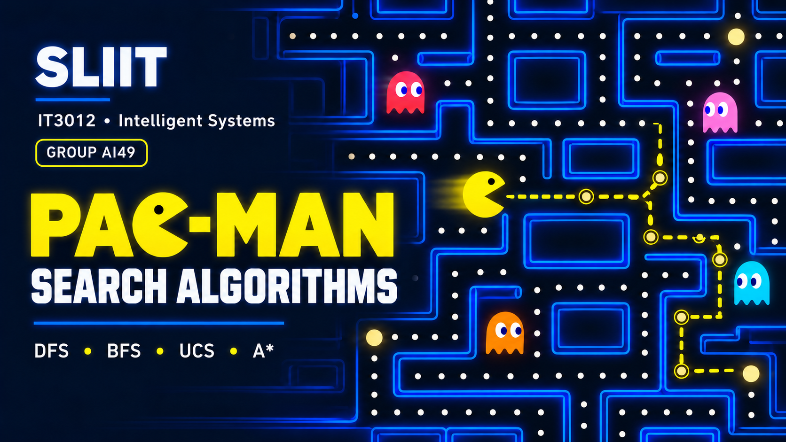

# Search Algorithms in Pac-Man



**IT3012 Intelligent Systems — Group Assignment (Group AI49)**
Faculty of Computing, SLIIT · Year 3 · 2026

---

## About the Project

This project applies classical Artificial Intelligence search algorithms to the Pac-Man game environment. Based on the UC Berkeley CS188 Pac-Man AI project, it focuses on planning paths through maze-like environments using graph search and informed search strategies.

Pac-Man uses these algorithms to plan routes, reach food, visit required locations, and complete structured search goals.

The project covers:

### Uninformed Search

* **Depth-First Search (DFS)**
* **Breadth-First Search (BFS)**
* **Uniform Cost Search (UCS)**

These algorithms are implemented as graph-search algorithms and explore the state space without using domain-specific heuristic information.

### Informed Search

* **A* Search**
* Pluggable heuristic functions
* Cost-based path planning using estimated remaining distance

### Advanced Search Problems

* **Corners Problem**

  * Pac-Man must visit all four corners of the maze.
* **Corners Heuristic**

  * A heuristic designed to be admissible and consistent.
* **Food Search Problem**

  * A heuristic for efficiently finding a route that allows Pac-Man to collect all food dots.

The implementations are tested using the provided autograder and test cases.

---

## Project Structure

```text
Pacman Search Algorithms/
│
├── search.py
├── searchAgents.py
├── pacman.py
├── autograder.py
├── layouts/
├── test_cases/
└── README.md
```

### Main Files

* `search.py` — Generic search algorithms and related search functions.
* `searchAgents.py` — Pac-Man search problems, heuristics, and agent behaviour.
* `pacman.py` — Pac-Man game engine and simulation.
* `autograder.py` — Automated grading and testing script.
* `layouts/` — Maze layouts used by the Pac-Man game.
* `test_cases/` — Test inputs and expected outputs for assignment questions.
* `README.md` — Project documentation.

---

## Search Algorithms Implemented

### 1. Depth-First Search (DFS)

Function:

```python
depthFirstSearch(problem)
```

DFS explores one branch as deeply as possible before backtracking.

It uses a **stack (LIFO)** data structure.

---

### 2. Breadth-First Search (BFS)

Function:

```python
breadthFirstSearch(problem)
```

BFS explores all states at the current depth before moving to the next level.

It uses a **queue (FIFO)** data structure.

---

### 3. Uniform Cost Search (UCS)

Function:

```python
uniformCostSearch(problem)
```

UCS expands the state with the lowest accumulated path cost.

It uses a **priority queue** where the priority is based on the path cost.

---

### 4. A* Search

Function:

```python
aStarSearch(problem, heuristic)
```

A* combines the cost already travelled with an estimated cost to the goal:

```text
f(n) = g(n) + h(n)
```

where:

* `g(n)` = cost from the start to the current state
* `h(n)` = estimated cost from the current state to the goal
* `f(n)` = total estimated cost

A* can find efficient paths when an appropriate heuristic is used.

---

## Advanced Problems

### Corners Problem

The Corners Problem requires Pac-Man to visit all four corners of the maze.

The search state keeps track of:

* Pac-Man's current position
* Which corners have already been visited

The goal is reached when all four corners have been visited.

### Corners Heuristic

A heuristic is used to estimate the remaining cost required to visit all unvisited corners.

The heuristic is designed to be:

* Admissible
* Consistent

This helps A* search efficiently while maintaining optimality under the assignment requirements.

### Food Search Problem

The Food Search Problem requires Pac-Man to collect all food dots.

A heuristic is used to estimate the remaining distance needed to collect the food efficiently.

---

## Running the Project

Make sure Python is installed and available from the terminal.

Check the Python version:

```powershell
py --version
```

If Python 3.11 is installed:

```powershell
py -3.11 --version
```

### Run DFS

```bash
python pacman.py -p SearchAgent -a fn=depthFirstSearch
```

### Run BFS

```bash
python pacman.py -p SearchAgent -a fn=breadthFirstSearch
```

### Run UCS

```bash
python pacman.py -p SearchAgent -a fn=uniformCostSearch
```

### Run A*

```bash
python pacman.py -p SearchAgent -a fn=aStarSearch,heuristic=nullHeuristic
```

### Run the Autograder

```bash
python autograder.py
```

If Python 3.11 is specifically required:

```powershell
py -3.11 autograder.py
```

---

## Assignment Coverage

The project follows the standard Pac-Man AI assignment structure:

| Question | Topic                |
| -------- | -------------------- |
| Q1       | Depth-First Search   |
| Q2       | Breadth-First Search |
| Q3       | Uniform Cost Search  |
| Q4       | A* Search            |
| Q5       | Corners Problem      |
| Q6       | Corners Heuristic    |
| Q7       | Food Heuristic       |

---

## Team Members

| Member               | Student ID | Questions                                    | Additional Responsibilities                                 |
| -------------------- | ---------- | -------------------------------------------- | ----------------------------------------------------------- |
| **P P Kavindi**      | IT24101611 | Q1 — DFS, Q2 — BFS                           | Repository setup, README, final report assembly             |
| **Fernando M S T**   | IT24101063 | Q3 — UCS, Q4 — A* Search                     | Git evidence screenshots, contribution table                |
| **Bodini G V E J**   | IT24101177 | Q5 — Corners Problem, Q6 — Corners Heuristic | Node-count testing for Q6                                   |
| **De Silva T H H D** | IT24101010 | Q7 — Food Heuristic                          | AI usage declaration, full autograder run before submission |

---

## Development Environment

### Python

The project is tested using **Python 3.11**.

Check the installed version:

```powershell
py -3.11 --version
```

The project can be executed using the Python interpreter available in the development environment.

---

## Testing and Validation

The implementations are validated using the provided Pac-Man autograder.

Run:

```bash
python autograder.py
```

The autograder checks the implemented search algorithms and related search problems against the assignment test cases.

Individual search algorithms can also be tested by running the Pac-Man simulator with the appropriate `SearchAgent` configuration.

---

## Git and Collaboration

The project is maintained using Git and GitHub.

The development workflow includes:

```text
Create Branch
      ↓
Implement Question
      ↓
Test Implementation
      ↓
Commit Changes
      ↓
Push Branch
      ↓
Create Pull Request
      ↓
Code Review / CI Checks
      ↓
Merge into Main
```

Pull Requests are used to review changes before they are merged into the main branch.

---

## Notes

This repository is designed for academic learning and follows the UC Berkeley Pac-Man AI project structure.

The objective is to understand how different search algorithms influence:

* Path finding
* Search efficiency
* Path cost
* Heuristic evaluation
* Goal-directed behaviour
* Intelligent agent planning

---

## License and Attribution

This project is based on the UC Berkeley Pac-Man AI projects and retains the original attribution and educational-use licensing.

---

**IT3012 Intelligent Systems — Group AI49**
**Faculty of Computing, SLIIT · Year 3 · 2026**
